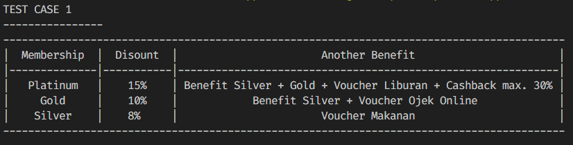
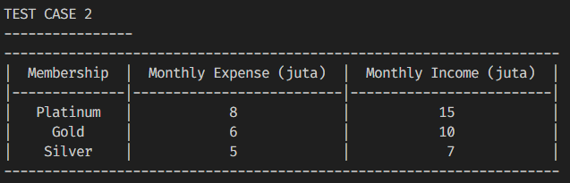
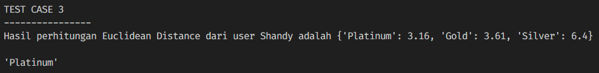
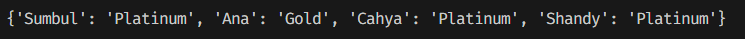
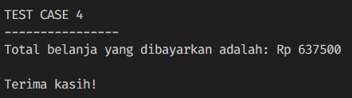
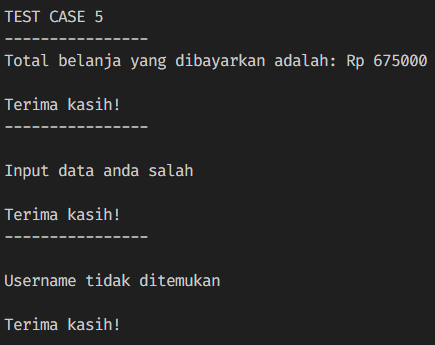
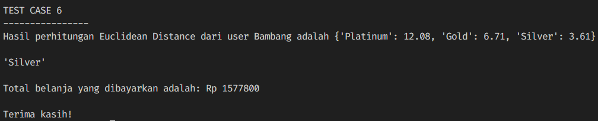

# Customer Membership Program

## 1. Case Description

PacCommerce is a new e-commerce service that has tier membership feature:
- **Silver**
- **Gold**
- **Platinum**

Each tier membership has the benefit provided in this table: 

| **Membership** | **Discount** |                     **Another Benefit**                     |
|:--------------:|:------------:|:-----------------------------------------------------------:|
|    Platinum    |      15%     | Benefit Silver + Gold + Voucher Liburan + Cashback max. 30% |
|      Gold      |      10%     | Benefit Silver + Voucher Ojek Online                        |
|     Silver     |      8%      | Voucher Makanan                                             |

Each tier membership has also the requirements:

| **Membership** | **Monthly Expense (juta)** | **Monthly Income (juta)** |
|:--------------:|:--------------------------:|:-------------------------:|
|    Platinum    |              8             | 15                        |
|      Gold      |              6             | 10                        |
|     Silver     |              5             | 7                         |

## 2. Features Requirement

- Show benefit and price of each tier membership
- Show requirements for each tier membership
- Predict membership for user based on their monthly expense and monthly income
- Update user data after predicting membership
- Calculate final price and discount based on their membership

## 3. Data

The user data is dictionary type containing:
- Username
- Membership (Platinum, Gold, Silver)

## 4. Test Case

In test case, there is a new user named **Shandy**. We predict his membership based on his **monthly expense
(Rp 9.000.000) and monthly income (Rp 12.000.000)**. Then calculating final dan discount price for his shopping

#### 1. Show benefit and price of each tier membership

#### 2. Show requirements for each tier membership

#### 3. Predict membership for user based on their monthly expense and monthly income

#### 4. Update user data after predicting membership

#### 5. Calculate final price and discount based on membership prediction

## 5. Special Test Case

- In special test case 1, there are users named **Ana and Elsa**. User **Ana** is already in our data,
  while user **Elsa** is not listed in our data.

  

- In special test case 2, there is a new user named **Bambang**. We predict his membership based on his **monthly expense
  (Rp 3.000.000) and monthly income (Rp 4.000.000)**. Then calculating final and discount price for his shopping.

  

**Author** Copyright (c) *2024 Muhammad Chavez Assad Patriot*
